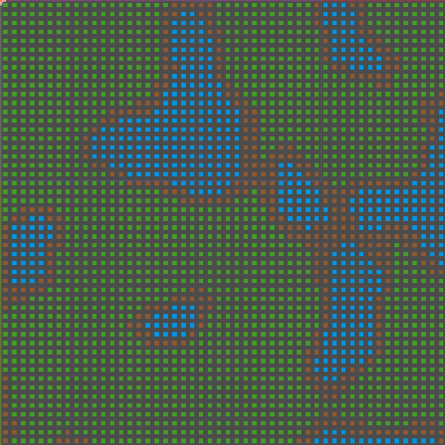
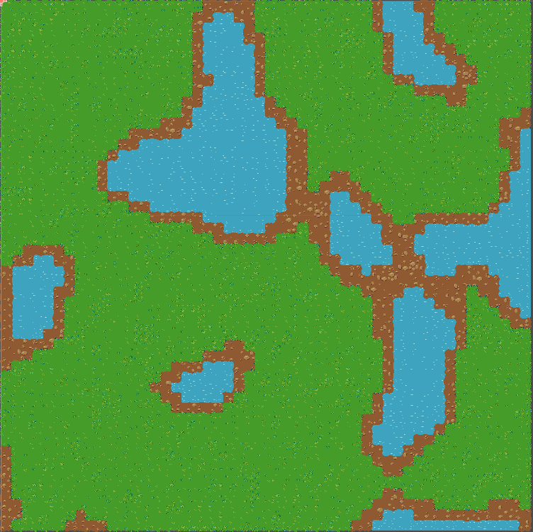

# PolyGrid2D

PolyGrid2D is a Godot 4.5 C# addon for generating and updating tile-based terrain visuals from a set of layered tilemap inputs.

It is designed for projects that need procedural terrain transitions, variant selection based on neighboring tiles, and a lightweight generation workflow directly inside Godot.

## Features

- Procedural tile selection based on neighboring tile masks (Auto tiling)
- Support for multiple visual layers with shared logic rules
- Deterministic variant selection using a configurable seed
- Optional parallel updates for larger areas
- Example scene and assets included in the addon folder
- Built for Godot 4.5 with C# support
- Uses 16-tilesets, which reduces the workload for artists by simplifying tile creation and setup

## Requirements

- Godot 4.5+
- C# enabled in the Godot project
- .NET SDK compatible with the project target framework

## Project structure

- [project.godot](project.godot) — Godot project entry point
- [PolyGrid2D.csproj](PolyGrid2D.csproj) — C# project definition
- [addons/PolyGrid2D](addons/PolyGrid2D) — the addon source and example assets
  - [addons/PolyGrid2D/Scripts](addons/PolyGrid2D/Scripts) — core scripts
  - [addons/PolyGrid2D/Example](addons/PolyGrid2D/Example) — example scene and tileset assets

## Installation

1. Copy or clone this repository into your Godot project.
2. Make sure the addon folder is available at `res://addons/PolyGrid2D`.
3. Godot recognizes this addon through `addons/PolyGrid2D/plugin.cfg`.
4. Open the project in Godot and enable the addon in `Project > Project Settings > Plugins`.
5. Use the example scene in [addons/PolyGrid2D/Example/poly_grid_example.tscn](addons/PolyGrid2D/Example/poly_grid_example.tscn) as a starting point.

## Usage

### 1. Add a PolyGridMap

Use the `PolyGridMap` node in a scene and assign the visual layers (`TileMapLayer`) you want to control and a placeholder tile set.

### 2. Configure the tile set

The addon expects a custom data layer named `layerId` in the tile set. This layer is used to associate placeholder tiles with terrain layers. Configure a terrain in each terrain tile sets for auto tiling to work.

### 3. Use the terrain generator (optional)

The `TerrainGenerator` script can generate terrain based on a `Noise` resource and weighted layers.

### 4. Draw your map

Draw in the `PolyGridMap` using the placeholders and it will automatically draw in the terrain layers.

Typical workflow:

- Create a `PolyGridMap`
- Assign one or more visual layers
- Configure placeholders in the tile set
- Attach a `TerrainGenerator`
- Provide a noise resource and generation bounds
- Run generation from the editor tool button

## Example

The example scene is available at [addons/PolyGrid2D/Example/poly_grid_example.tscn](addons/PolyGrid2D/Example/poly_grid_example.tscn).
It demonstrates how to set up the addon with placeholder tiles and a basic terrain setup.

### Example workflow

1. Start by drawing your map with placeholder tiles.
2. The addon converts these placeholders into the final terrain layers.

#### Before: placeholders

#### After: drawn map

## Notes

- All visual layers should use the same tile size as the main `PolyGridMap` tile set.
- The addon uses placeholder tiles to identify layer IDs in the tile set.
- If no tile exists for a given mask and layer, the editor will log an error and the tile selection will fail for that case.

## License

This project is released under the MIT License. See [LICENSE](LICENSE) for details.
